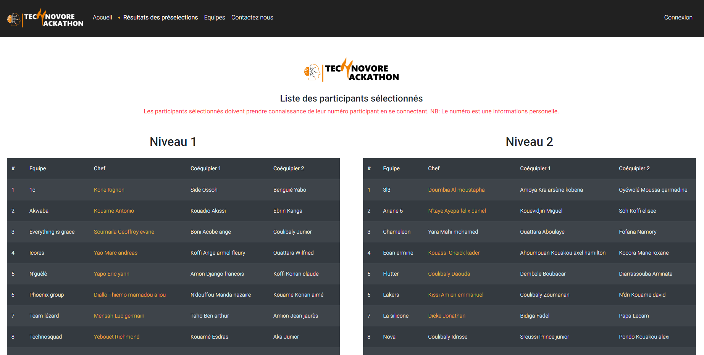
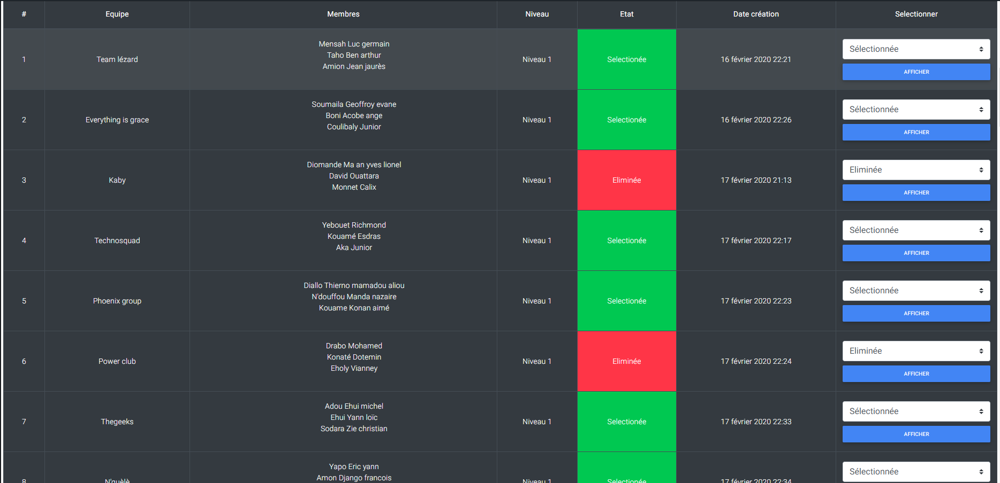

# TechnoHack 2020 - De l'année 2019-2020

## Description

TechnoHack est une application mise en place par une petite équipe composée de 3 étudiants de l'ESATIC. Son objectif était de faciliter la gestion des participants de la phase d'inscription à la phase des résultats de l'Hackathon Technovore de l'ESATIC.

## Réalisation

### L'application 

Il s'agit d'une application web développée avec Django et qui a été hébergé sur la plateforme Cloud Heroku. Elle a été mise à jour régulièrement au cours de l'organisation de l'hackathon afin de répondre aux besoins du comité d'organisation. Ainsi, le code ne suit pas une logique bien établie mais contient une grande quantité d'adaptations que seul l'administrateur du site et les développeurs peuvent comprendre aisement. En d'autres termes c'est une application improvisée !

### Environnement de développement

L'application a été développée sur un machine tournant sur Windows 10 avec la version 3.7.3 de python et Django en version 3.0.3 . D'où la présence d'un fichier run.bat permettant de faciliter l'activation de l'environnement virtuel du projet.

## Fonctionnalités
Le système d'information et les règles de gestion ne seront pas détaillés ici mais uniquement les fonctionnalités

### Basiques

- Gestion des participants
	- Inscription
	- Connexion
	- Espace équipe

- Résultats
	- Affichage
	- Préselection

#### Gestion des participants

Permettre aux étudiants de l'ESATIC de s'inscrire en équipe de 3 avec un membre de l'équipe comme chef d'équipe. Leur permettre de se connecter(de deconnecter) pour accéder à l'espace de leur équipe.
**NB: A Chaque participant était associée un ID unique lui permettant d'être identifié par le comité d'organisation. Cela a permis par exemple de faciliter le suivi de la consommation des participants et des membres du comité d'organisation.**

#### Résultats

Cette fonctionnalité permet d'afficher les résultats de la compétition(Présélection puis résultats finaux) et d'éffectuer la sélection des équipes au travers d'un tableau de control.

**Cependant les résultats finaux non pas été disponible car le marquage d'une équipe comme gagnante n'a pas été implémenté.**

Suite est en cours de rédaction...

